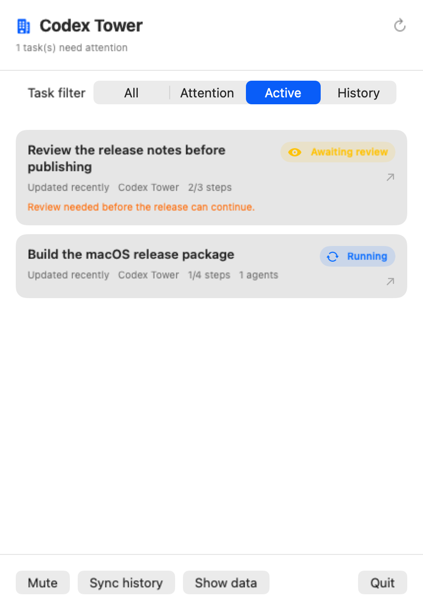

# Codex Tower

**A local macOS menu-bar dashboard for Codex tasks — with sound alerts when a task needs you or is explicitly completed.**

Codex Tower helps you keep track of multiple Codex conversations without constantly switching between them. It collects lightweight task-status metadata locally and presents it in a compact native menu-bar dashboard.



## Why Codex Tower

- **Never miss a completed task.** Codex Tower plays a macOS notification sound when a task is explicitly marked complete.
- **Know when attention is needed.** It also alerts you when Codex is waiting for approval or a turn is ready for review.
- **Act from the alert.** Native macOS notifications show the task title; clicking one opens the matching Codex conversation.
- **See live work first.** The dashboard opens on active tasks, so imported history never buries what is happening now.
- **Return to any task in one click.** Select a task card to open its matching Codex conversation.
- **Handle tasks without context switching.** Attention cards include quick **Done** and **Later** actions; Later hides a task for one hour.
- **Stay in control.** Filter All, Attention, Active, Done, and History tasks; completed tasks move to History after 24 hours.
- **Use your language.** The menu-bar interface follows the macOS system language and supports English and Simplified Chinese.

## Privacy first

Codex Tower stores only local task metadata, such as task title, lifecycle status, update time, plan progress, and subagent count.

It **does not read, store, or upload** conversation transcripts, tool output, or other sensitive task content. By default, data stays on your Mac at:

```text
~/Library/Application Support/Codex Tower
```

## Install

### 1. Install the menu-bar app

Download the latest `Codex Tower-*-macos-arm64.dmg` from [Releases](https://github.com/Hyp-Plus/codex-tower/releases), open it, then drag **Codex Tower** into **Applications**. Launch the app once — it will appear in the menu bar instead of the Dock.

### 2. Install the Codex plugin

In Terminal, register the Codex Tower marketplace:

```zsh
codex plugin marketplace add Hyp-Plus/codex-tower
```

Then open Codex, go to **Plugins**, select **Codex Tower Marketplace**, and click **Install** on Codex Tower. Review and trust its lifecycle hooks when prompted, then start a new Codex task.

> Codex Tower currently supports Apple Silicon Macs running macOS 13 or later. The app is locally signed but not notarized; if macOS blocks the first launch, right-click the app in Applications and choose **Open**.

## How it works

```text
Codex lifecycle hooks  →  local JSON metadata  →  Codex Tower menu-bar dashboard
```

Lifecycle hooks update local metadata as a task changes state. The menu-bar app refreshes from those files once per second. No task data is sent through a cloud service.

## Sound alerts

On macOS, Codex Tower uses built-in system sounds:

- `Basso` when Codex needs approval.
- `Glass` when a task is ready for review.
- `Hero` when a task is explicitly marked complete.

Use the **Mute** button in the dashboard, or the plugin settings tool, to silence notifications.

## Complete a task from Codex

After reviewing a task directly in Codex, send `task complete` as a standalone message in that same conversation. Codex Tower marks the task as completed immediately, plays the completion sound, and keeps the command out of the model conversation. Chinese users can send `验收完成` instead.

## Development

```zsh
cd menu-bar-app
zsh build-app.sh
open "dist/Codex Tower.app"

# Build the drag-to-Applications installer
zsh package-dmg.sh
```

The project has three parts:

- `hooks/` records Codex task lifecycle events.
- `server/` provides local task queries, history sync, and notification settings.
- `menu-bar-app/` is the native SwiftUI menu-bar application.

## Contributing

Issues and pull requests are welcome. Please preserve Codex Tower's local-only privacy boundary: contributions must not collect or upload conversation content.
